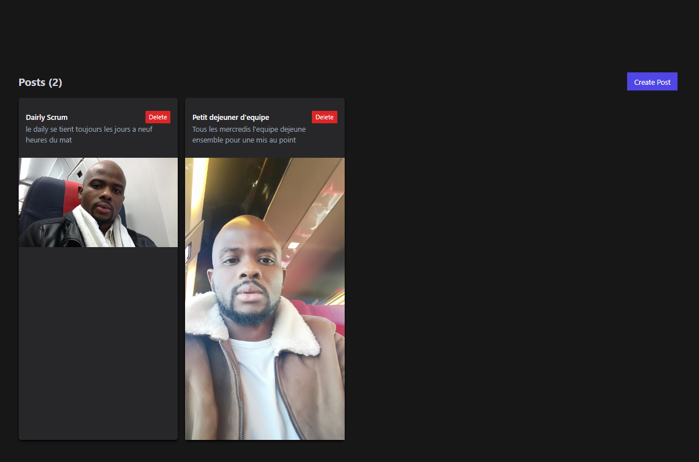

# "Mongo Express React Node Context"

This is a MERN Stack Application CRUD with image upload using React Hook useContext

# Considerations

1. Backend: http://localhost:4000
2. Frontend: http://localhost:3000

The frontend will be served from the backend in production, but in development it will be served using a proxy

# Cloduinary

This application uses Cloudinary as Image Hosting, so you need to provide the following environment variables. You can find this on your Cloudinary's profile

1. CLOUD_NAME
2. API_KEY
3. API_SECRET

# Mongodb

MONGODB_URI=mongodb://localhost/merndb

# `screenShot`

